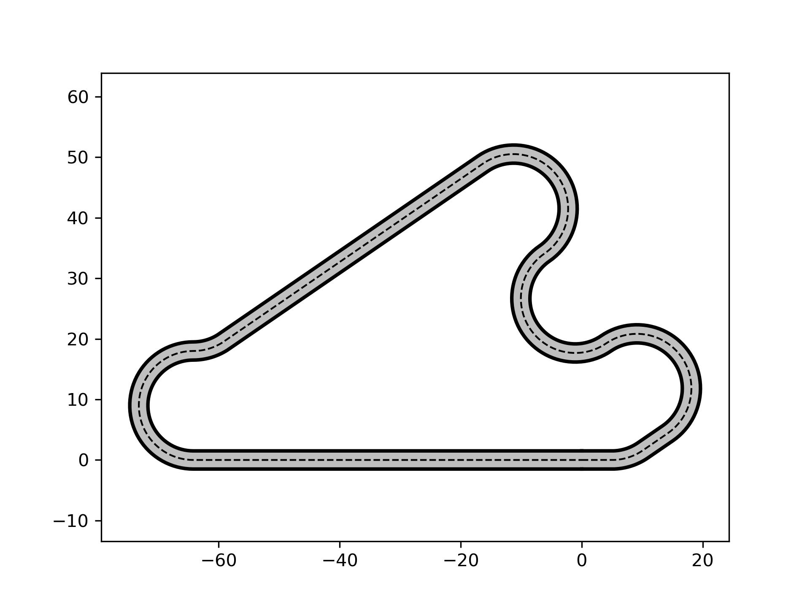
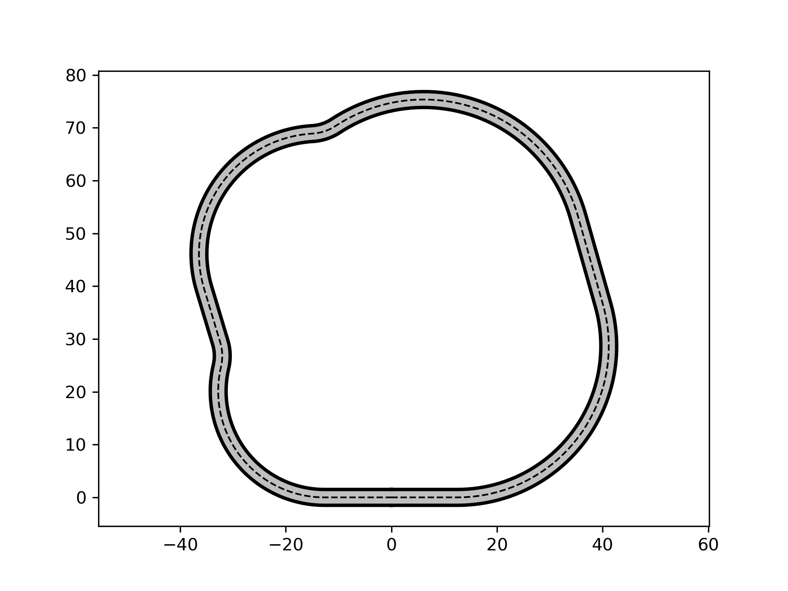
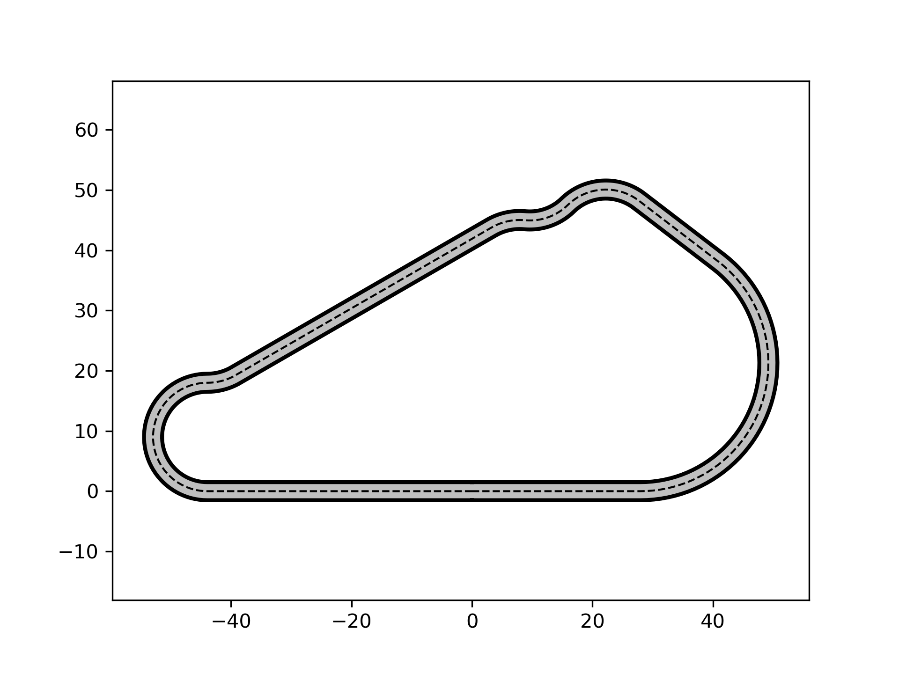

# trackgen
Tool to generate tracks quickly using curvilinear coordinates.

## Usage
1. Define an initial track:
  - define the number of track segments (*straight* or *corner*) and indicate where the corners are (defined by Boolean array);
  - define the length parameters (radius for corners, length for straights);
  - define the angle change in a corner *(for corners only)*.
2. Define constraints:
These are all defined in the `Track()` object. Examples are maximum straight length, minimum/maximum radius, et cetera.
3. Optimize the track:
This will satisfy all constraints *(if successful)*.
You can decide to maximize curvature *(case 0)*, minimize curvature *(case 1)*, or have no objective at all and only satisfy the constraints *(case 2)*.
Case 2 is particularly useful if you are trying to generate a lot of tracks, because an initial track perturbation will likely lead to a different final track.
See examples below.
This is because there are usually infinitely many tracks that adhere to the constraints.
4. Plot the track/export to something else.

## Limitations
We are solving this problem as a continuous optimization problem, which brings with it certain limitations.
Once you start with an initial track, certain parameters will not change:
- number of straights, corners, and their order stays the same;
- direction of a corner stays the same (i.e., the sign of the radius will not change);
- there is no constraint to prevent the track from intersecting with itself, if that is the case, change the initial track.

## Notes
1. The track width is assumed constant, but this can easily be changed to change along the track;
2. I started on a gradient implementation of the constraints using an adjoint.
Finite differencing, however, seemed to work fine for this problem, so I shelved that for now.
Let me know if you run into issues with larger problems (i.e., the tool being slow), then I will address that by a more efficient gradient implementation.
3. If you give it a horrific initial track, the tool might not be able to find a track that satisfies the constraints.
If that is the case, check your constraints and inputs!
For instance, if you want the track to be right-turning and the initial guess only has left-turning corners, things will break.
Or if your constraints do not define a feasible set (i.e., a long track length, but restricted to short straights and corners).
